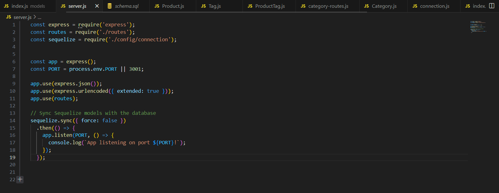

# E-commerce-Back-End

## Description
In this project, I have created a back-end database containing the proper code to deploy GET, POST and DELETE requests in insomnia. 

### Installation
From the "E-commerce-Back-End" repository (https://github.com/RG-GitUser/E-commerce-Back-End) select the "Code" dropdown.
Using the "Code" dropdown, click on "SSH".
On the "SSH" tab, select the "copy" button next to the address.
Next, open your git bash terminal (or for mac users, homebrew)
Use the command "git clone" and "insert coppied SSH key here" then press enter.
Enter the "cd "enter path here" " command to navigate to the correct directory.
You now have the repository cloned to your system! To verify, the command "ls" to view the items listed inside of the repository.

### Usage

Users are able to store information on products with associated informatoin like prices and product id. 

### Screenshot: 

### Application

### Credits
full stack Xpert Learning Assistant

devdocs.io: https://devdocs.io
